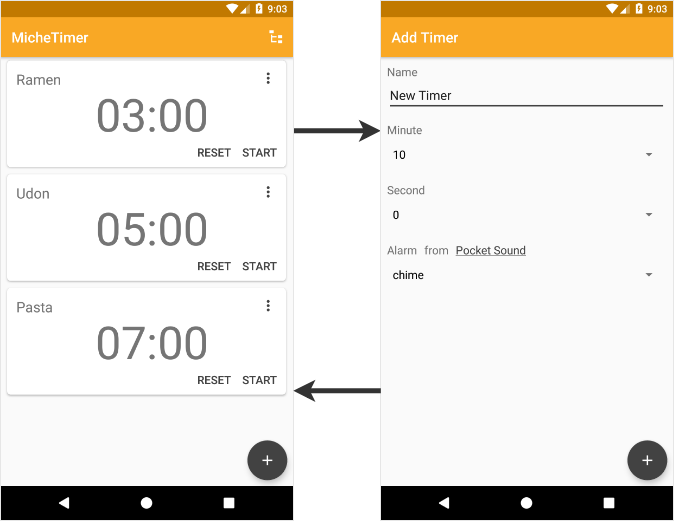

# このプロジェクトの概要

Androidで動作するシンプルなタイマーアプリです。

このタイマーアプリは[Miche Timer](https://play.google.com/store/apps/details?id=kaleidot725.michetimer)として[Play Store](https://play.google.com/store/apps/details?id=kaleidot725.michetimer)に公開しています。

# このプロジェクトの技術

このプロジェクトはフルKotlinで開発しています。

その他には下記の手法やアーキテクチャ、ライブラリを用いて開発しています。

* [Kotlin Programming Language](https://kotlinlang.org/)
* [Test Driven Development](https://ja.wikipedia.org/wiki/%E3%83%86%E3%82%B9%E3%83%88%E9%A7%86%E5%8B%95%E9%96%8B%E7%99%BA)
* [Model View ViewModel](https://ja.wikipedia.org/wiki/Model_View_ViewModel)
* [Android Architecture Components](https://developer.android.com/topic/libraries/architecture/)
* [RxKotlin](https://github.com/ReactiveX/RxKotlin)
* [kotshi](https://github.com/ansman/kotshi)

